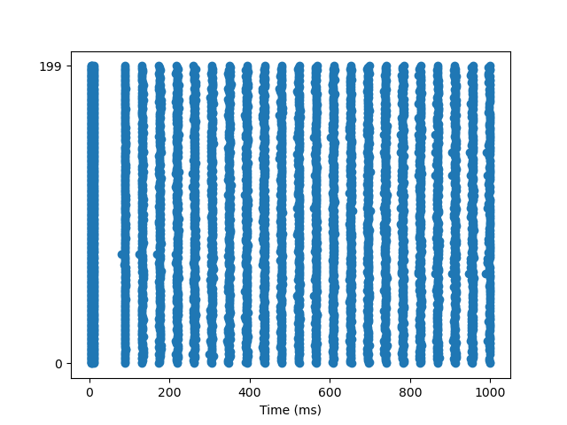

# SpikeNetOpt.jl
A julia Spiking Neural Network Optimizer
The Evolutionary.jl package provides Genetic Algorithms that are used to optimize spiking neural networks

The loss function is constructed by computing Spike Distance between all pairs of neurons
Networks are optimized using pair wise spike-distance metric on each pair of neurons
Pythons NetworkUnit package is used to perform a posthoc evaluation of the optimized network.

See the figure below where local variation and firing rates are compared against every neuron between two model networks.

For example this is a ground truth model versus an optimized model t-test of firing rates:
```
Student's t-test
	datasize: 200 	 200
	t = 11.811 	 p value = 1.82e-25
```





# DONE

- [x] Used spike distance and genetic algorithms to optimize networks quickly
- [x] Implemented multi-threading
- [x] Used pythons NetworkUnit to validate results
- [x] NetworkUnit t-tests of results

## TODO
- [ ] Animation of Genetic Algorithm Convergence.
- [ ] Different Spiking Neural Network Backends (WaspNet.jl,SpikingNN.jl)
@russelljjarvis
- [ ] Multiprocessing as opposed to multi-threading
- [ ] GPU
- [ ] NeuroEvolution @russelljjarvis
- [ ] Stochastic Gradient Defence
