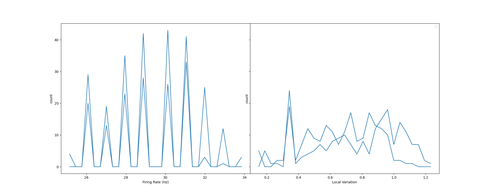

# SpikeNetOpt.jl
A julia Spiking Neural Network Optimizer
Using Spike Distance, Genetic Algorithms, stochastic gradient descent.

Networks are optimized using pair wise spike-distance metric on each pair of neurons
Pythons NetworkUnit package is used to perform a posthoc evaluation of the optimized network.

